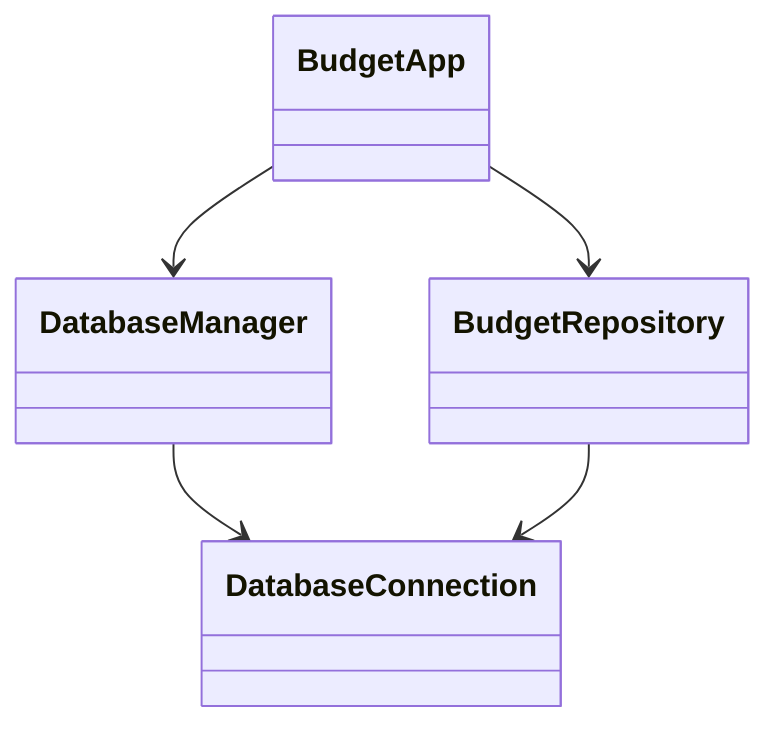
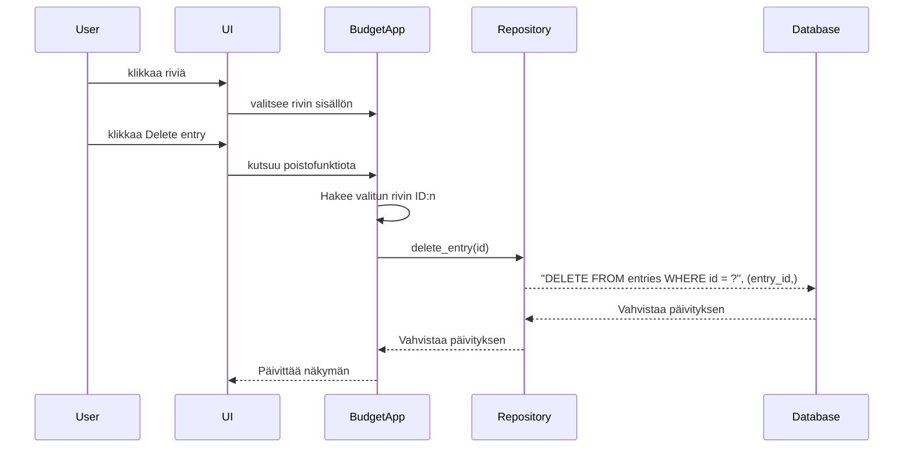

```mermaid
classDiagram
    direction TB

    class BudgetApp {
    }

    class DatabaseManager {
    }

    class BudgetRepository {
    }

    class DatabaseConnection {
    }

    BudgetApp --> DatabaseManager
    BudgetApp --> BudgetRepository
    DatabaseManager --> DatabaseConnection
    BudgetRepository --> DatabaseConnection
```

Poistamisen sekvenssikaavio:

```mermaid
sequenceDiagram
    participant User
    participant UI
    participant BudgetApp
    participant Repository
    participant Database

    User->>UI: klikkaa riviä
    UI->>BudgetApp: valitsee rivin sisällön
    User->>UI: klikkaa Delete entry
    UI->>BudgetApp: kutsuu poistofunktiota
    BudgetApp->>BudgetApp: Hakee valitun rivin ID:n
    BudgetApp->>Repository: delete_entry(id)
    Repository-->>Database: "DELETE FROM entries WHERE id = ?", (entry_id,)
    Database-->>Repository: Vahvistaa päivityksen
    Repository-->>BudgetApp: Vahvistaa päivityksen
    BudgetApp-->>UI: Päivittää näkymän
```
