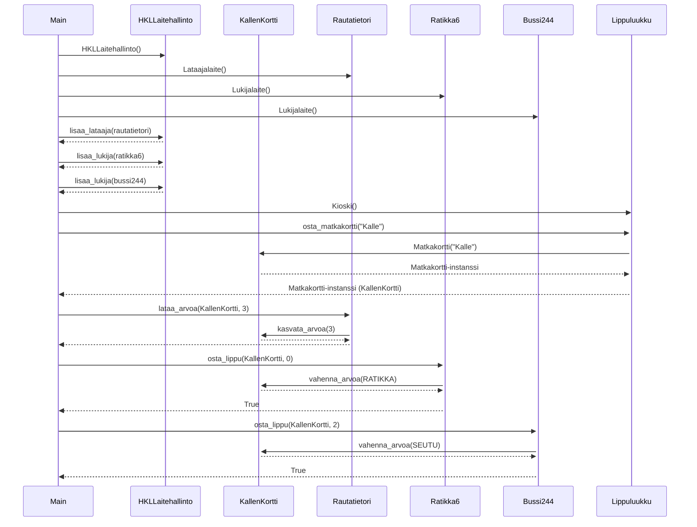

```mermaid
sequenceDiagram
    participant Main
    participant HKLLaitehallinto

    participant Matkakortti as KallenKortti

    Main->>HKLLaitehallinto: HKLLaitehallinto()
    activate HKLLaitehallinto

    Main->>Rautatietori: Lataajalaite()
    activate Rautatietori

    Main->>Ratikka6: Lukijalaite()
    activate Ratikka6

    Main->>Bussi244: Lukijalaite()
    activate Bussi244

    Main->>HKLLaitehallinto: lisaa_lataaja(rautatietori)
    HKLLaitehallinto-->>Main: 

    Main->>HKLLaitehallinto: lisaa_lukija(ratikka6)
    HKLLaitehallinto-->>Main: 

    Main->>HKLLaitehallinto: lisaa_lukija(bussi244)
    HKLLaitehallinto-->>Main: 

    Main->>Lippuluukku: Kioski()
    activate Lippuluukku

    Main->>Lippuluukku: osta_matkakortti("Kalle")
    Lippuluukku->>Matkakortti: Matkakortti("Kalle")
    activate Matkakortti
    Matkakortti-->>Lippuluukku: Matkakortti-instanssi
    Lippuluukku-->>Main: Matkakortti-instanssi (KallenKortti)

    Main->>Rautatietori: lataa_arvoa(KallenKortti, 3)
    Rautatietori->>Matkakortti: kasvata_arvoa(3)
    Matkakortti-->>Rautatietori: 
    Rautatietori-->>Main: 

    Main->>Ratikka6: osta_lippu(KallenKortti, 0)
    Ratikka6->>Matkakortti: vahenna_arvoa(RATIKKA)
    Matkakortti-->>Ratikka6: 
    Ratikka6-->>Main: True

    Main->>Bussi244: osta_lippu(KallenKortti, 2)
    Bussi244->>Matkakortti: vahenna_arvoa(SEUTU)
    Matkakortti-->>Bussi244: 
    Bussi244-->>Main: True

```
