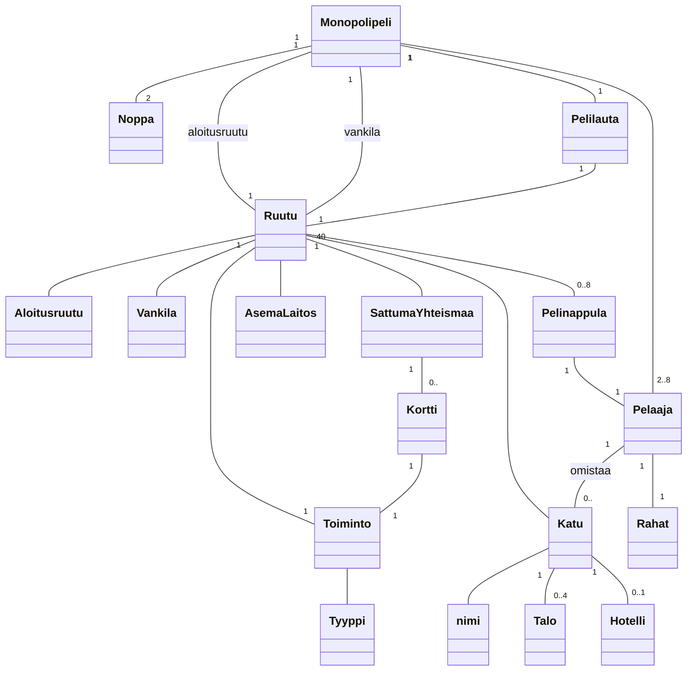

```mermaid
  classDiagram
    Monopolipeli "1" -- "2" Noppa
    Monopolipeli "1" -- "1" Pelilauta
    Monopolipeli "1" -- "1" Ruutu : aloitusruutu
    Monopolipeli "1" -- "1" Ruutu : vankila
    Pelilauta "1" -- "40" Ruutu
    Ruutu -- Aloitusruutu
    Ruutu -- Vankila
    Ruutu -- SattumaYhteismaa
    Ruutu -- AsemaLaitos
    Ruutu -- Katu
    Katu -- nimi
    Ruutu "1" -- "1" Toiminto
    Toiminto -- Tyyppi
    Ruutu "1" -- "0..8" Pelinappula
    Pelinappula "1" -- "1" Pelaaja
    Pelaaja "2..8" -- "1" Monopolipeli
    Pelaaja "1" -- "0.._" Katu : omistaa
    Pelaaja "1" -- "1" Rahat
    Katu "1" -- "0..4" Talo
    Katu "1" -- "0..1" Hotelli
    SattumaYhteismaa "1" -- "0.._" Kortti
    Kortti "1" -- "1" Toiminto
```
